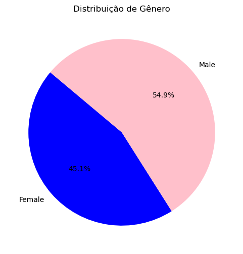
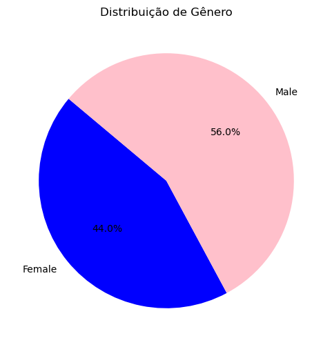
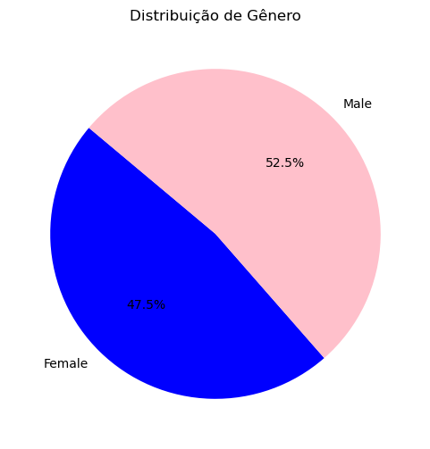

#### Esse é um projeto de ETL simples para o BOOTCAMP do Banco Santander juntamente com a plataforma DIO. O dataset utilizado nesse projeto é público do Kaggle.

#### Desafio: O Banco enviou um arquivo csv contendo uma base com vários clientes espalhados por alguns países e solicitou que fosse feito um dataset para cada país da base de dados - em arquivo excel -para que posteriormente cada diretor de marketing de cada país constante receba seu arquivo. O banco solicitou também que juntamente com o dataset seja encaminhado um gráfico simples com a divisão dos clientes por M e F. e a resposta para a pergunta abaixo:
- Que faixa etária tem maior score de crédito (entre todos os países)?
    - Abaixo de 25 anos
    - De 25 a 30 anos
    - De 31 a 35 anos
    - De 36 a 40 anos
    - De 41 a 45 anos
    - Acima de 46 anos


```python
# 1 - Solicitou que fosse feito um dataset para cada país em arquivo excel
# 2 - Solicitou um gráfico simples com a divisão de clientes por M e F de cada dataset criado
# 3 - Qual faixa etária tem o maior score de crédito envolvendo todos os países
```


```python
# Importanto a biblioteca pandas para a leita do dataset
import pandas as pd

# Importanto a biblioteca openpyxl para criar arquivos em excel
from openpyxl import Workbook

# Importando matplotlib para criação de gráficos
import matplotlib.pyplot as plt
```


```python
# Fazendo a leitura do arquivo.
df = pd.read_csv('dataset_churn.csv', delimiter=',')
df.shape
```


    (10000, 14)


```python
# Verificando as colunas e eventuais campos vazios.
df.isnull().sum()
```


    RowNumber          0
    CustomerId         0
    Surname            0
    CreditScore        0
    Geography          0
    Gender             0
    Age                0
    Tenure             0
    Balance            0
    NumOfProducts      0
    HasCrCard          0
    IsActiveMember     0
    EstimatedSalary    0
    Exited             0
    dtype: int64


```python
# Informações do dataset
df.info()
```

    <class 'pandas.core.frame.DataFrame'>
    RangeIndex: 10000 entries, 0 to 9999
    Data columns (total 14 columns):
     #   Column           Non-Null Count  Dtype  
    ---  ------           --------------  -----  
     0   RowNumber        10000 non-null  int64  
     1   CustomerId       10000 non-null  int64  
     2   Surname          10000 non-null  object 
     3   CreditScore      10000 non-null  int64  
     4   Geography        10000 non-null  object 
     5   Gender           10000 non-null  object 
     6   Age              10000 non-null  int64  
     7   Tenure           10000 non-null  int64  
     8   Balance          10000 non-null  float64
     9   NumOfProducts    10000 non-null  int64  
     10  HasCrCard        10000 non-null  int64  
     11  IsActiveMember   10000 non-null  int64  
     12  EstimatedSalary  10000 non-null  float64
     13  Exited           10000 non-null  int64  
    dtypes: float64(2), int64(9), object(3)
    memory usage: 1.1+ MB
    


```python
# Devido o questionamento do banco,
# Optei por dropar algumas colunas que não terão utilidade para a resposta da questão.
df1 = df.drop(
    ["RowNumber", "Surname", "Tenure", "Balance", 
     "NumOfProducts", "HasCrCard", "IsActiveMember", "Exited"], axis = 1)
```


```python
df1.head()
```


<div>
<style scoped>
    .dataframe tbody tr th:only-of-type {
        vertical-align: middle;
    }

    .dataframe tbody tr th {
        vertical-align: top;
    }

    .dataframe thead th {
        text-align: right;
    }
</style>
<table border="1" class="dataframe">
  <thead>
    <tr style="text-align: right;">
      <th></th>
      <th>CustomerId</th>
      <th>CreditScore</th>
      <th>Geography</th>
      <th>Gender</th>
      <th>Age</th>
      <th>EstimatedSalary</th>
    </tr>
  </thead>
  <tbody>
    <tr>
      <th>0</th>
      <td>15634602</td>
      <td>619</td>
      <td>France</td>
      <td>Female</td>
      <td>42</td>
      <td>101348.88</td>
    </tr>
    <tr>
      <th>1</th>
      <td>15647311</td>
      <td>608</td>
      <td>Spain</td>
      <td>Female</td>
      <td>41</td>
      <td>112542.58</td>
    </tr>
    <tr>
      <th>2</th>
      <td>15619304</td>
      <td>502</td>
      <td>France</td>
      <td>Female</td>
      <td>42</td>
      <td>113931.57</td>
    </tr>
    <tr>
      <th>3</th>
      <td>15701354</td>
      <td>699</td>
      <td>France</td>
      <td>Female</td>
      <td>39</td>
      <td>93826.63</td>
    </tr>
    <tr>
      <th>4</th>
      <td>15737888</td>
      <td>850</td>
      <td>Spain</td>
      <td>Female</td>
      <td>43</td>
      <td>79084.10</td>
    </tr>
  </tbody>
</table>
</div>


```python
# Verificar quantos cadastros únicos existem no df
customer_unique = len(df1.loc[:, 'CustomerId'].unique())
print('O numero de cadastros unicos é: {}'.format(customer_unique))
```

    O numero de cadastros unicos é: 10000
    


```python
# Não há cadastros duplicados pois a quantidade de linhas é igual ao de cadastros únicos
quantidade_linhas = df.shape[0]
print("Quantidade de linhas:", quantidade_linhas)
```

    Quantidade de linhas: 10000
    


```python
# Agora eu preciso saber quantos países únicos eu tenho em meu dataframe
paises_unicos = df1.loc[:, 'Geography'].unique()
paises_unicos

# E saber quais são
print("Nomes dos países únicos:")
for pais in paises_unicos:
    print(pais)
```

    Nomes dos países únicos:
    France
    Spain
    Germany
    

### 1 - Solicitou que fosse feito um dataset para cada país em arquivo excel


```python
# Aqui eu vou criar os arquivos em excel para cada país - france, germany e spain
# (certifique-se de ter instalado o openxyl)
grupo_por_pais = df1.groupby('Geography')

for pais, dados in grupo_por_pais:
    # Criar um novo Workbook do openpyxl
    wb = Workbook()
    ws = wb.active
    colunas = list(dados.columns)
    ws.append(colunas)
    dados_lista = dados.values.tolist()
    for linha in dados_lista:
        ws.append(linha)

    # Salvar o Workbook em um arquivo Excel
    nome_arquivo = f"{pais}.xlsx"  # Nome do arquivo será o nome do país
    wb.save(nome_arquivo)
```

### 2 - O Banco solicitou um gráfico simples com a divisão de clientes por M e F de cada df criado.

#### 2.1 - Criando um dataframe da França.


```python
# Criando um dataframe da França
df_france = df1[df1['Geography'] == 'France'].copy()
df_france
```


<div>
<style scoped>
    .dataframe tbody tr th:only-of-type {
        vertical-align: middle;
    }

    .dataframe tbody tr th {
        vertical-align: top;
    }

    .dataframe thead th {
        text-align: right;
    }
</style>
<table border="1" class="dataframe">
  <thead>
    <tr style="text-align: right;">
      <th></th>
      <th>CustomerId</th>
      <th>CreditScore</th>
      <th>Geography</th>
      <th>Gender</th>
      <th>Age</th>
      <th>EstimatedSalary</th>
    </tr>
  </thead>
  <tbody>
    <tr>
      <th>0</th>
      <td>15634602</td>
      <td>619</td>
      <td>France</td>
      <td>Female</td>
      <td>42</td>
      <td>101348.88</td>
    </tr>
    <tr>
      <th>2</th>
      <td>15619304</td>
      <td>502</td>
      <td>France</td>
      <td>Female</td>
      <td>42</td>
      <td>113931.57</td>
    </tr>
    <tr>
      <th>3</th>
      <td>15701354</td>
      <td>699</td>
      <td>France</td>
      <td>Female</td>
      <td>39</td>
      <td>93826.63</td>
    </tr>
    <tr>
      <th>6</th>
      <td>15592531</td>
      <td>822</td>
      <td>France</td>
      <td>Male</td>
      <td>50</td>
      <td>10062.80</td>
    </tr>
    <tr>
      <th>8</th>
      <td>15792365</td>
      <td>501</td>
      <td>France</td>
      <td>Male</td>
      <td>44</td>
      <td>74940.50</td>
    </tr>
    <tr>
      <th>...</th>
      <td>...</td>
      <td>...</td>
      <td>...</td>
      <td>...</td>
      <td>...</td>
      <td>...</td>
    </tr>
    <tr>
      <th>9994</th>
      <td>15719294</td>
      <td>800</td>
      <td>France</td>
      <td>Female</td>
      <td>29</td>
      <td>167773.55</td>
    </tr>
    <tr>
      <th>9995</th>
      <td>15606229</td>
      <td>771</td>
      <td>France</td>
      <td>Male</td>
      <td>39</td>
      <td>96270.64</td>
    </tr>
    <tr>
      <th>9996</th>
      <td>15569892</td>
      <td>516</td>
      <td>France</td>
      <td>Male</td>
      <td>35</td>
      <td>101699.77</td>
    </tr>
    <tr>
      <th>9997</th>
      <td>15584532</td>
      <td>709</td>
      <td>France</td>
      <td>Female</td>
      <td>36</td>
      <td>42085.58</td>
    </tr>
    <tr>
      <th>9999</th>
      <td>15628319</td>
      <td>792</td>
      <td>France</td>
      <td>Female</td>
      <td>28</td>
      <td>38190.78</td>
    </tr>
  </tbody>
</table>
<p>5014 rows × 6 columns</p>
</div>


```python
# Criando um gráfico de pizza para clientes M e F da França
grupo_por_genero = df_france.groupby('Gender').size()
plt.figure(figsize=(6, 6))
plt.pie(grupo_por_genero, labels=grupo_por_genero.index, autopct='%1.1f%%', startangle=140, colors=['blue', 'pink'])
plt.title('Distribuição de Gênero')
plt.show()
```


    

    


### 2.2 - Criando um dataframe da Espanha.


```python
# Criando um dataframe da Espanha
df_spain = df1[df1['Geography'] == 'Spain'].copy()
df_spain
```


<div>
<style scoped>
    .dataframe tbody tr th:only-of-type {
        vertical-align: middle;
    }

    .dataframe tbody tr th {
        vertical-align: top;
    }

    .dataframe thead th {
        text-align: right;
    }
</style>
<table border="1" class="dataframe">
  <thead>
    <tr style="text-align: right;">
      <th></th>
      <th>CustomerId</th>
      <th>CreditScore</th>
      <th>Geography</th>
      <th>Gender</th>
      <th>Age</th>
      <th>EstimatedSalary</th>
    </tr>
  </thead>
  <tbody>
    <tr>
      <th>1</th>
      <td>15647311</td>
      <td>608</td>
      <td>Spain</td>
      <td>Female</td>
      <td>41</td>
      <td>112542.58</td>
    </tr>
    <tr>
      <th>4</th>
      <td>15737888</td>
      <td>850</td>
      <td>Spain</td>
      <td>Female</td>
      <td>43</td>
      <td>79084.10</td>
    </tr>
    <tr>
      <th>5</th>
      <td>15574012</td>
      <td>645</td>
      <td>Spain</td>
      <td>Male</td>
      <td>44</td>
      <td>149756.71</td>
    </tr>
    <tr>
      <th>11</th>
      <td>15737173</td>
      <td>497</td>
      <td>Spain</td>
      <td>Male</td>
      <td>24</td>
      <td>76390.01</td>
    </tr>
    <tr>
      <th>14</th>
      <td>15600882</td>
      <td>635</td>
      <td>Spain</td>
      <td>Female</td>
      <td>35</td>
      <td>65951.65</td>
    </tr>
    <tr>
      <th>...</th>
      <td>...</td>
      <td>...</td>
      <td>...</td>
      <td>...</td>
      <td>...</td>
      <td>...</td>
    </tr>
    <tr>
      <th>9966</th>
      <td>15590213</td>
      <td>479</td>
      <td>Spain</td>
      <td>Male</td>
      <td>35</td>
      <td>20393.44</td>
    </tr>
    <tr>
      <th>9980</th>
      <td>15719276</td>
      <td>741</td>
      <td>Spain</td>
      <td>Male</td>
      <td>35</td>
      <td>99595.67</td>
    </tr>
    <tr>
      <th>9987</th>
      <td>15588839</td>
      <td>606</td>
      <td>Spain</td>
      <td>Male</td>
      <td>30</td>
      <td>1914.41</td>
    </tr>
    <tr>
      <th>9989</th>
      <td>15605622</td>
      <td>841</td>
      <td>Spain</td>
      <td>Male</td>
      <td>28</td>
      <td>179436.60</td>
    </tr>
    <tr>
      <th>9992</th>
      <td>15657105</td>
      <td>726</td>
      <td>Spain</td>
      <td>Male</td>
      <td>36</td>
      <td>195192.40</td>
    </tr>
  </tbody>
</table>
<p>2477 rows × 6 columns</p>
</div>


```python
# Criando um gráfico de pizza para clientes M e F da Espanha
grupo_por_genero = df_spain.groupby('Gender').size()
plt.figure(figsize=(6, 6))
plt.pie(grupo_por_genero, labels=grupo_por_genero.index, autopct='%1.1f%%', startangle=140, colors=['blue', 'pink'])
plt.title('Distribuição de Gênero')
plt.show()
```


    

    


### 2.3 - Criando um dataframe da Alemanha.


```python
df_germany = df1[df1['Geography'] == 'Germany'].copy()
df_germany
```


<div>
<style scoped>
    .dataframe tbody tr th:only-of-type {
        vertical-align: middle;
    }

    .dataframe tbody tr th {
        vertical-align: top;
    }

    .dataframe thead th {
        text-align: right;
    }
</style>
<table border="1" class="dataframe">
  <thead>
    <tr style="text-align: right;">
      <th></th>
      <th>CustomerId</th>
      <th>CreditScore</th>
      <th>Geography</th>
      <th>Gender</th>
      <th>Age</th>
      <th>EstimatedSalary</th>
    </tr>
  </thead>
  <tbody>
    <tr>
      <th>7</th>
      <td>15656148</td>
      <td>376</td>
      <td>Germany</td>
      <td>Female</td>
      <td>29</td>
      <td>119346.88</td>
    </tr>
    <tr>
      <th>15</th>
      <td>15643966</td>
      <td>616</td>
      <td>Germany</td>
      <td>Male</td>
      <td>45</td>
      <td>64327.26</td>
    </tr>
    <tr>
      <th>16</th>
      <td>15737452</td>
      <td>653</td>
      <td>Germany</td>
      <td>Male</td>
      <td>58</td>
      <td>5097.67</td>
    </tr>
    <tr>
      <th>26</th>
      <td>15736816</td>
      <td>756</td>
      <td>Germany</td>
      <td>Male</td>
      <td>36</td>
      <td>170041.95</td>
    </tr>
    <tr>
      <th>28</th>
      <td>15728693</td>
      <td>574</td>
      <td>Germany</td>
      <td>Female</td>
      <td>43</td>
      <td>100187.43</td>
    </tr>
    <tr>
      <th>...</th>
      <td>...</td>
      <td>...</td>
      <td>...</td>
      <td>...</td>
      <td>...</td>
      <td>...</td>
    </tr>
    <tr>
      <th>9982</th>
      <td>15768163</td>
      <td>655</td>
      <td>Germany</td>
      <td>Female</td>
      <td>46</td>
      <td>115146.40</td>
    </tr>
    <tr>
      <th>9984</th>
      <td>15696175</td>
      <td>602</td>
      <td>Germany</td>
      <td>Male</td>
      <td>35</td>
      <td>51695.41</td>
    </tr>
    <tr>
      <th>9986</th>
      <td>15581736</td>
      <td>673</td>
      <td>Germany</td>
      <td>Male</td>
      <td>47</td>
      <td>34047.54</td>
    </tr>
    <tr>
      <th>9990</th>
      <td>15798964</td>
      <td>714</td>
      <td>Germany</td>
      <td>Male</td>
      <td>33</td>
      <td>53667.08</td>
    </tr>
    <tr>
      <th>9998</th>
      <td>15682355</td>
      <td>772</td>
      <td>Germany</td>
      <td>Male</td>
      <td>42</td>
      <td>92888.52</td>
    </tr>
  </tbody>
</table>
<p>2509 rows × 6 columns</p>
</div>


```python
# Criando um gráfico de pizza para clientes M e F da Espanha
grupo_por_genero = df_germany.groupby('Gender').size()
plt.figure(figsize=(6, 6))
plt.pie(grupo_por_genero, labels=grupo_por_genero.index, autopct='%1.1f%%', startangle=140, colors=['blue', 'pink'])
plt.title('Distribuição de Gênero')
plt.show()
```


    

    


### 3 - Qual faixa etária tem o maior score de crédito envolvendo todos os países.


```python
# Criando as faixas etárias
faixas_etarias = [
    ('Abaixo de 25 anos', (0, 25)),
    ('De 25 a 30 anos', (25, 30)),
    ('De 31 a 35 anos', (31, 35)),
    ('De 36 a 40 anos', (36, 40)),
    ('De 41 a 45 anos', (41, 45)),
    ('Acima de 46 anos', (46, 200))
]

# Adicionando uma nova coluna ao dataframe com a faixa etária correspondente
df1['Faixa Etária'] = pd.cut(df1['Age'], bins=[start for _, (start, _) in faixas_etarias] + [200], labels=[faixa for faixa, _ in faixas_etarias])

# Agrupando os dados por faixa etária e calculando a média do CreditScore
media_scores_por_faixa = df1.groupby('Faixa Etária')['CreditScore'].mean()

# Encontrando a faixa etária com a maior média do CreditScore
faixa_maior_media = media_scores_por_faixa.idxmax()

print("Faixa etária com maior média do CreditScore:", faixa_maior_media)
```

    Faixa etária com maior média do CreditScore: De 36 a 40 anos
    

Faixa etária com maior média do CreditScore: De 36 a 40 anos
